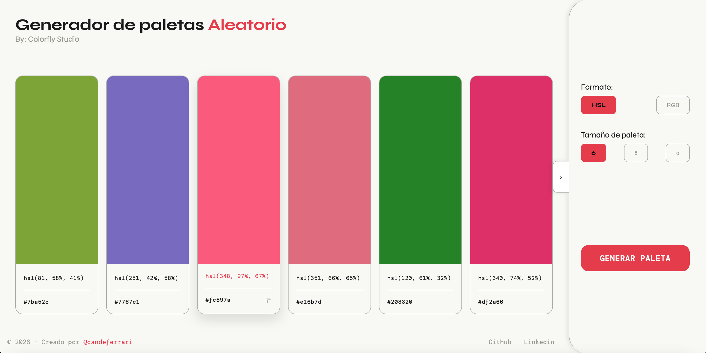

# ProyectoM1_CandelariaFerrari
# 🎨 Generador de Paletas — Colorfly Studio




🔗 **[Ver demo en vivo](https://candelariaferrari.github.io/ProyectoM1_CandelariaFerrari/)**


---

## 📋 Descripción

Herramienta web desarrollada para **Colorfly Studio**, una agencia de branding que necesitaba acelerar su flujo creativo. Permite generar paletas de colores aleatorias de forma rápida e intuitiva, con opciones de personalización y feedback visual inmediato.

Proyecto final del módulo 01 — Soy Henry.

---

## ✨ Funcionalidades

### Obligatorias
- ✅ Generación aleatoria de paletas de colores
- ✅ Selección del tamaño de paleta (6, 8 o 9 colores)
- ✅ Visualización de colores en formato **HSL**, **HEX** y **RGB**
- ✅ Feedback visual inmediato mediante toast al copiar un color
- ✅ HTML semántico y consideraciones de accesibilidad

### Extra credit
- ✅ Copiar el código del color al portapapeles al hacer clic
- ✅ Animaciones sutiles en hover y carga de página
- ✅ Mejoras visuales de UI: sidebar colapsable, diseño responsive.

---

## 🖥️ Manual de usuario

### ¿Cómo generar una paleta?
Hacé clic en el botón **"Generar paleta"**.

### ¿Cómo cambiar el tamaño?
En el panel lateral, seleccioná entre **6**, **8** o **9** colores. La paleta se regenera automáticamente. Para una experiencia más cómoda, también podés colapsar el panel lateral.

### ¿Cómo cambiar el formato del color?
En el panel lateral, seleccioná entre **HEX**, **RGB** o **HSL**. Los códigos se actualizan sin regenerar la paleta.

### ¿Cómo copiar un color?
Hacé clic sobre cualquier card. El código del color en el formato HEX se copia automáticamente al portapapeles y aparece una confirmación.

### ¿Cómo colapsar el panel lateral?
En desktop, usá el botón `›` que aparece en el borde izquierdo del panel. En mobile, usá el botón **"Opciones de paleta"** en la parte superior.

---

## 🛠️ Decisiones técnicas

### Generación de colores en HSL
Los colores se generan en formato HSL como base, con rangos controlados:
- **Saturación**: 40–100% → evita colores apagados o grises
- **Luminosidad**: 30–70% → evita colores muy oscuros o muy claros

Esto garantiza que cada paleta generada sea visualmente agradable. Las conversiones a HEX y RGB se derivan del HSL original.

### Almacenamiento del color en `dataset`
Cada card guarda su color HSL original en `data-hsl`. Esto permite cambiar el formato (HEX / RGB / HSL) sin regenerar la paleta — solo se actualiza el texto visible.

### CSS sin nesting
Se optó por selectores CSS aplanados en lugar de CSS nesting para garantizar compatibilidad con todos los navegadores, incluyendo versiones anteriores de Safari.

### Separación de responsabilidades en JS
Las funciones están divididas por propósito:
- **Generación**: `randomHsl()`
- **Conversión**: `hslToHex()`, `hslToRgb()`, `hslToString()`
- **Presentación**: `generarPaleta()`, `actualizarFormato()`
- **UI**: `toggleSidebar()`, `showToast()`

### Accesibilidad
- Radio buttons ocultos con `opacity: 0` en lugar de `display: none` para mantener el foco de teclado
- `:focus-visible` implementado en los controles
- `aria-label` en botones icónicos
- `aria-label` en la grilla de paleta

---

## 🚀 Cómo ejecutar el proyecto en local

No requiere instalación ni dependencias. Al ser una aplicación web estática, solo necesitás un navegador.

```bash
# 1. Cloná el repositorio
git clone https://github.com/candelariaferrari/ProyectoM1_CandelariaFerrari.git

# 2. Entrá a la carpeta
cd tu-repositorio

# 3. Abrí el archivo index.html en tu navegador
# Podés hacer doble clic sobre el archivo, o usar Live Server en VS Code
```

> 💡 **Recomendado**: usar la extensión [Live Server](https://marketplace.visualstudio.com/items?itemName=ritwickdey.LiveServer) de VS Code para ver los cambios en tiempo real.

---

## 🌐 Cómo desplegar en GitHub Pages

```bash
# 1. Asegurate de que tu rama principal se llama "main"
git branch -M main

# 2. Subí los cambios a GitHub
git add .
git commit -m "deploy: versión final"
git push origin main
```

Luego en GitHub:
1. Ir a **Settings** → **Pages**
2. En **Source** seleccionar `Deploy from a branch`
3. Elegir la rama `main` y la carpeta `/ (root)`
4. Hacer clic en **Save**

En unos minutos el sitio estará disponible en `https://tu-usuario.github.io/tu-repositorio`

---

## 🗂️ Estructura del proyecto

```
📁 proyecto-m1/
├── 📄 index.html
├── 📁 assets/
│   └── 📄 screenshot-proyecto.png
├── 📁 css/
│   └── 📄 style.css
├── 📁 js/
│   └── 📄 script.js
└── 📄 README.md
```

---

## 🧰 Tech Stack


---

## 👩‍💻 Autora

**Candelaria Ferrari** — [@candeferrari](https://github.com/candeferrari)

Proyecto final 01 — Soy Henry